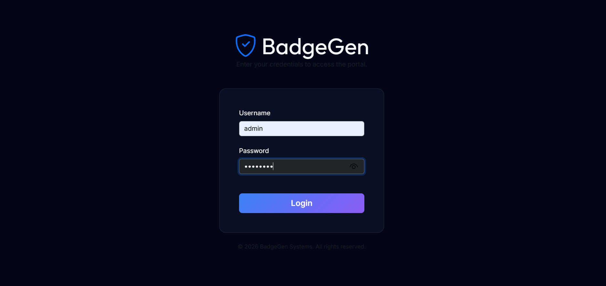
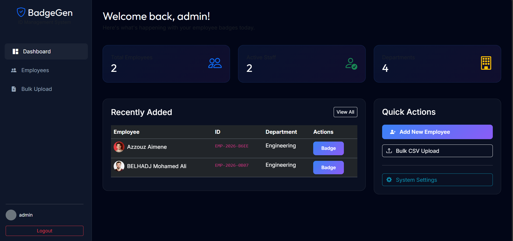

# BadgeAppFTP

**PhD Research Project**  
**University of Ziane Achour – Djelfa**  
**Module:** FTP  
**Author:** BELHADJ Mohamed Ali  

---

## 📋 Project Overview

**BadgeAppFTP** is a specialized research application developed to automate the secure synchronization of badge management data using FTP-based protocols. The application facilitates the reliable transfer of employee badge information — including user credentials, access logs, and profile assets — between local badge systems and centralized remote servers.

This project is part of doctoral research at the **University of Ziane Achour (Djelfa)**, focusing on evaluating the efficiency, reliability, and security of file transfer protocols in academic and professional badge management infrastructures.

---

## ✨ Key Features

- **Automated Synchronization** – Seamless uploading of badge data and associated media files to a centralized FTP server
- **Protocol Flexibility** – Support for standard FTP, FTPS, and SFTP protocols
- **Secure Data Transfer** – Implementation of secure variants to ensure confidentiality and integrity of sensitive information
- **Comprehensive Audit Logging** – Detailed logging of all transfer operations for monitoring and traceability
- **Scalable Architecture** – Designed to efficiently handle batch processing of badge records and media assets

---

## 🖥️ Application Screenshots

### Login Interface


### Dashboard


### New Employee Registration


### Badge Preview


### Project File Structure


---

## 🛠️ Technical Implementation

The application follows a **client-server architecture**, where **BadgeAppFTP** serves as the client responsible for collecting badge data and securely pushing it to remote FTP/FTPS/SFTP servers.

### Prerequisites
- **Python** 3.10 or higher
- Access to an FTP/FTPS/SFTP server
- Required dependencies listed in `requirements.txt`

---

## 📥 Installation & Setup

### 1. Clone the Repository
```bash
git clone https://github.com/blhjmedali/BadgeAppFTP.git
cd BadgeAppFTP
